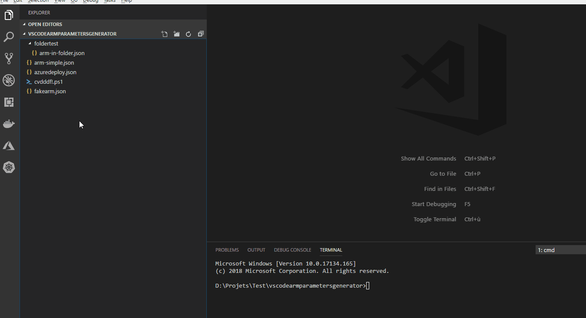

# README

## Features

Generate Azure RM Parameters files : 
* Right click on Azure RM file to generate a new Azure RM parameter file
* Right click on Azure RM File from explorer
* Right click on Azure RM File from editor title
* Use command **Azure RM: Generate parameter files**

Consolidate existing parameters file, only add missing parameters: 
* Use command **Azure RM: Consolidate parameters files**

## Configuration 
* Set config **arm-params-generator.ignoreDefaultParameters** to ignore default parameters from ARM template file

## Changelog

See [CHANGELOG.md](CHANGELOG.md)